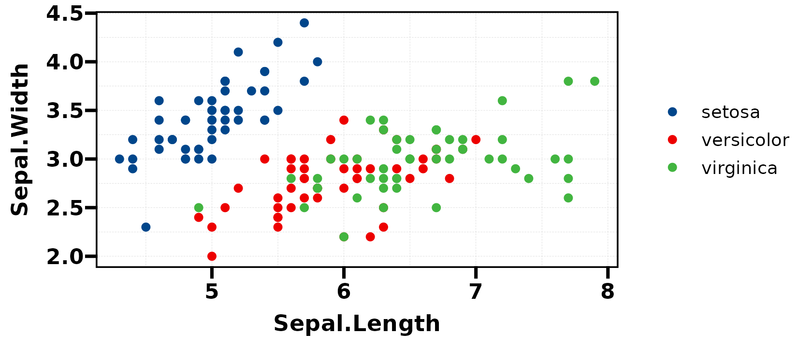
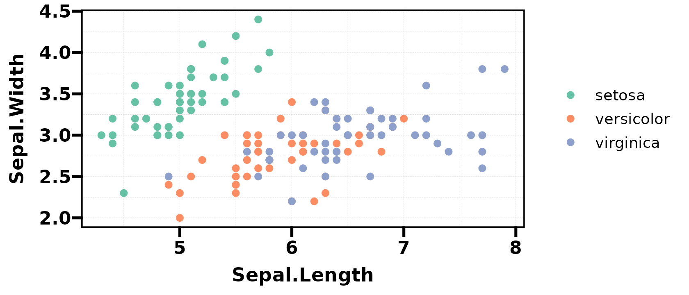
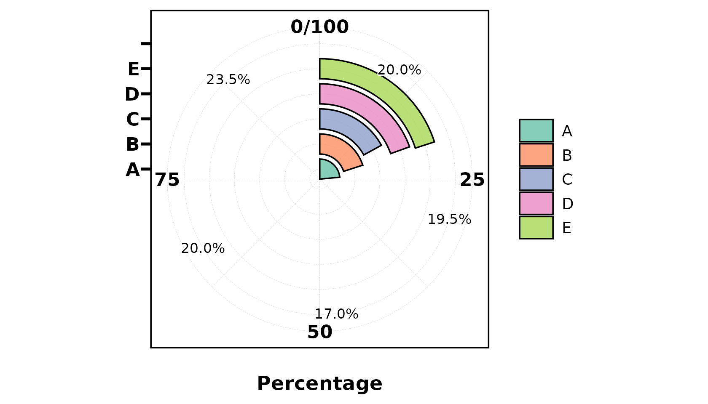
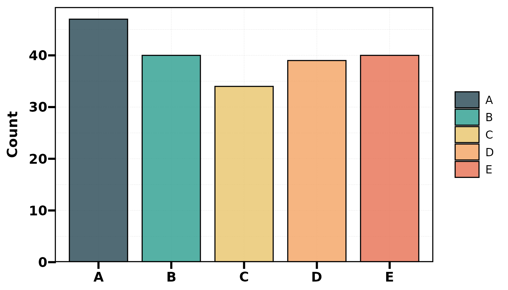
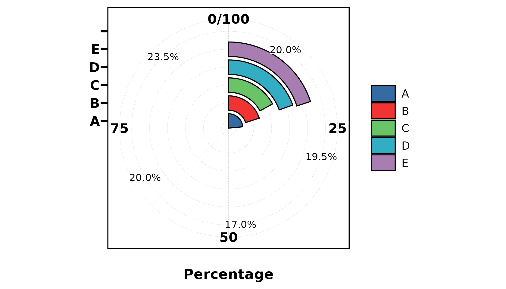

# Colour Palettes

``` r
library(UtilsR)
library(ggplot2)
```

## Overview

UtilsR provides a palette system with 256+ colour schemes from
RColorBrewer, ggsci, viridis, rcartocolor, nord, and more.

**Core components:**

| Function                                                                     | Purpose                                            |
|------------------------------------------------------------------------------|----------------------------------------------------|
| `pal_lancet`                                                                 | Default palette object (15 Lancet journal colours) |
| `palette_list`                                                               | Named list of 256 palettes                         |
| [`pal_get()`](https://hui950319.github.io/UtilsR/reference/pal_get.md)       | Extract colours from any palette by name           |
| [`pal_show()`](https://hui950319.github.io/UtilsR/reference/pal_show.md)     | Visualise a palette as colour swatches             |
| [`pal_list()`](https://hui950319.github.io/UtilsR/reference/pal_list.md)     | Browse all available palette names                 |
| [`show_color()`](https://hui950319.github.io/UtilsR/reference/show_color.md) | Display any colour vector in console               |
| [`as_palette()`](https://hui950319.github.io/UtilsR/reference/as_palette.md) | Create custom palette objects                      |

------------------------------------------------------------------------

## `pal_lancet` — Default Palette

The built-in default palette used by
[`plt_cat()`](https://hui950319.github.io/UtilsR/reference/plt_cat.md)
and other plot functions:

``` r
as.character(pal_lancet)
#>  [1] "#00468BFF" "#ED0000FF" "#42B540FF" "#0099B4FF" "#925E9FFF" "#FDAF91FF"
#>  [7] "#AD002AFF" "#ADB6B6FF" "#1B1919FF" "#79AF97FF" "#DF8F44FF" "#6A6599FF"
#> [13] "#FCCDE5FF" "#80B1D3FF" "#0000FFFF"
as.character(pal_lancet[1:5])
#> [1] "#00468BFF" "#ED0000FF" "#42B540FF" "#0099B4FF" "#925E9FFF"
```

``` r
ggplot(iris, aes(Sepal.Length, Sepal.Width, color = Species)) +
  geom_point(size = 2) +
  scale_color_manual(values = as.character(pal_lancet[1:3])) +
  theme_my()
```



------------------------------------------------------------------------

## `palette_list` — 256 Palettes

All palettes are stored in `palette_list` (internal data, accessed via
[`pal_get()`](https://hui950319.github.io/UtilsR/reference/pal_get.md)):

``` r
# Browse available palette names
head(names(UtilsR:::palette_list), 20)
#>  [1] "BrBG"     "PiYG"     "PRGn"     "PuOr"     "RdBu"     "RdGy"    
#>  [7] "RdYlBu"   "RdYlGn"   "Spectral" "Accent"   "Dark2"    "Paired"  
#> [13] "Pastel1"  "Pastel2"  "Set1"     "Set2"     "Set3"     "Blues"   
#> [19] "BuGn"     "BuPu"
length(UtilsR:::palette_list)
#> [1] 256
```

------------------------------------------------------------------------

## `pal_get()` — Extract Palette Colours

Retrieve colours from any palette by name:

``` r
# Get 5 colours from "Paired"
pal_get("Paired", n = 5)
#> [1] "#A6CEE3" "#1F78B4" "#B2DF8A" "#33A02C" "#FB9A99"

# Get 3 colours from "Set1"
pal_get("Set1", n = 3)
#> [1] "#E41A1C" "#377EB8" "#4DAF4A"

# Get 8 colours from "Dark2"
pal_get("Dark2", n = 8)
#> [1] "#1B9E77" "#D95F02" "#7570B3" "#E7298A" "#66A61E" "#E6AB02" "#A6761D"
#> [8] "#666666"
```

Use in ggplot2:

``` r
ggplot(iris, aes(Sepal.Length, Sepal.Width, color = Species)) +
  geom_point(size = 2) +
  scale_color_manual(values = as.character(pal_get("Set2", n = 3))) +
  theme_my()
```



------------------------------------------------------------------------

## `pal_show()` — Visualise Palettes

Display colour swatches for any palette:

``` r
pal_show("Paired")
pal_show("Set1")
```

------------------------------------------------------------------------

## `pal_list()` — Browse All Palettes

``` r
# Interactive palette browser (opens viewer)
pal_list()
```

------------------------------------------------------------------------

## `show_color()` — Display Any Colours

``` r
show_color(c("#FF6B6B", "#4ECDC4", "#45B7D1", "#96CEB4", "#FFEAA7"))
```

------------------------------------------------------------------------

## `as_palette()` — Custom Palettes

Create your own palette object with auto-display:

``` r
my_pal <- as_palette(c("#264653", "#2A9D8F", "#E9C46A", "#F4A261", "#E76F51"))
as.character(my_pal)  # display as plain hex vector
#> [1] "#264653" "#2A9D8F" "#E9C46A" "#F4A261" "#E76F51"
```

------------------------------------------------------------------------

## Use with `plt_cat()`

Palettes integrate seamlessly with plot functions:

``` r
set.seed(1)
df <- data.frame(Type = factor(sample(LETTERS[1:5], 200, TRUE)))

# Use named palette
plt_cat(df, "Type", type = "pie", label = TRUE, palette = "Set2")
```



``` r
# Use custom colours
plt_cat(df, "Type", type = "bar", stat = "count",
        palette = c("#264653", "#2A9D8F", "#E9C46A", "#F4A261", "#E76F51"))
```



``` r
# Default (pal_lancet) — no palette argument needed
plt_cat(df, "Type", type = "pie", label = TRUE)
```


