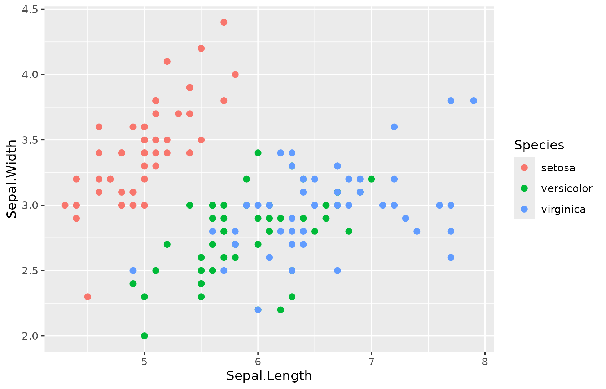
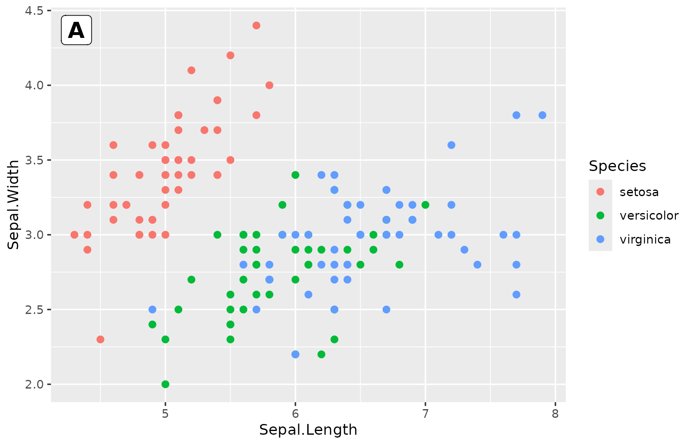
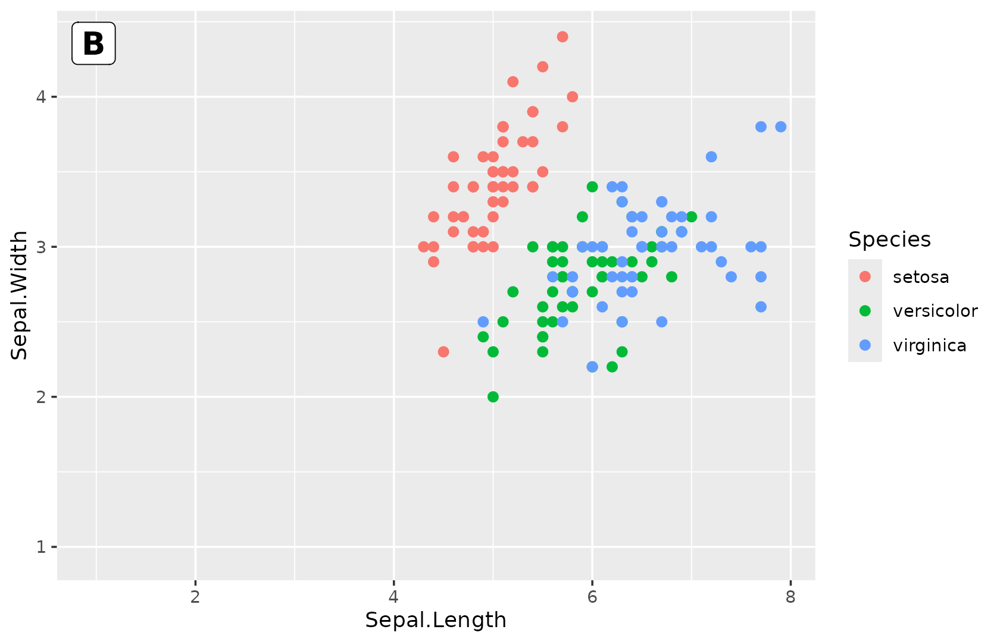
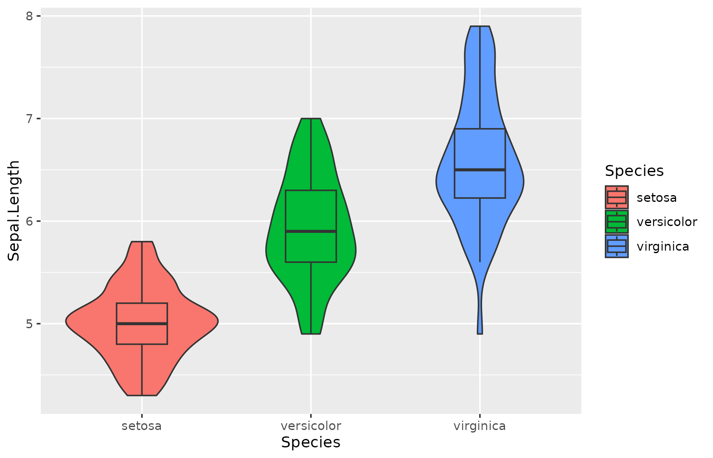
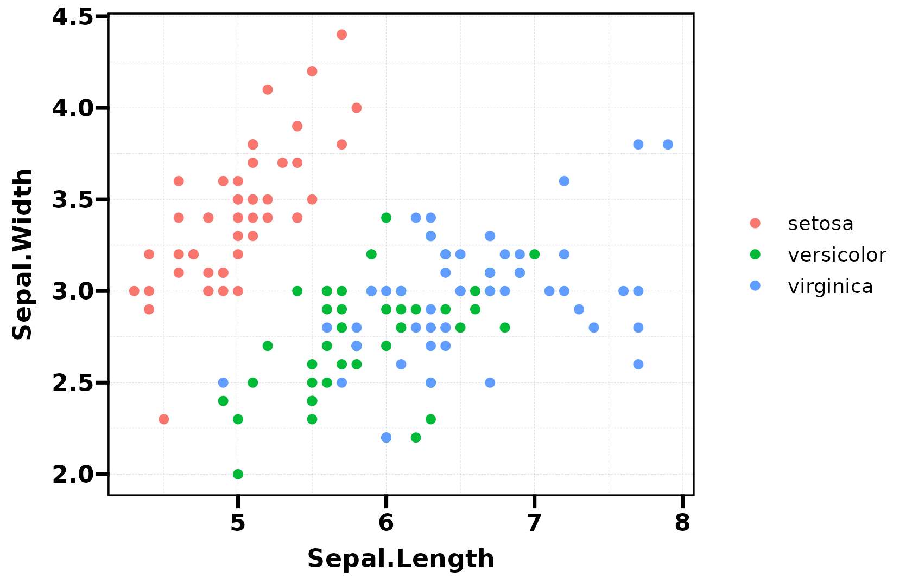
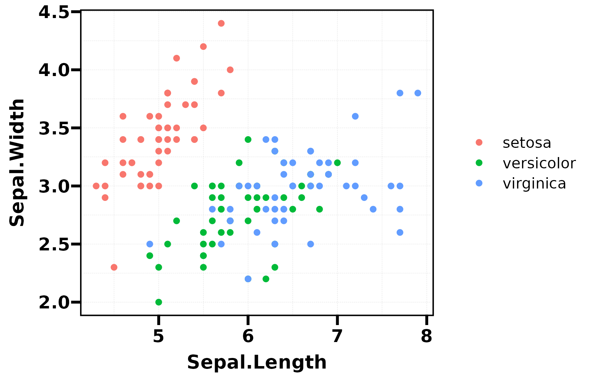

# ggplot2 Formatting: fmt\_\* and Themes

``` r
library(UtilsR)
library(ggplot2)
```

## Base Plot

All examples build on this base plot:

``` r
p <- ggplot(iris, aes(Sepal.Length, Sepal.Width, color = Species)) +
  geom_point(size = 2)
p
```



------------------------------------------------------------------------

## `fmt_plot()` — Master Chaining

Chain multiple formatting operations in one call:

``` r
p |> fmt_plot(
  legend.position = "bottom",
  tag = "A",
  base_size = 14
)
```


------------------------------------------------------------------------

## `fmt_tag()` — Panel Labels

``` r
p |> fmt_tag("A")
```



``` r
p |> fmt_tag("B", x = 0.95, y = 0.95, size = 16)
```



------------------------------------------------------------------------

## `fmt_legend()` — Legend Formatting

``` r
p |> fmt_legend(position = "bottom", direction = "horizontal")
```


------------------------------------------------------------------------

## `fmt_ref()` — Reference Lines

``` r
p |> fmt_ref(xintercept = 5.8, yintercept = 3.0)
```


``` r
# Multiple lines with colours
p |> fmt_ref(xintercept = c(5, 6, 7), color = c("red", "blue", "green"))
```


------------------------------------------------------------------------

## `fmt_axis()` — Axis Control

``` r
# Hide x-axis (useful for multi-panel layouts)
p |> fmt_axis(x = FALSE)
```


------------------------------------------------------------------------

## `fmt_strip()` — Facet Strip Colours

``` r
p_facet <- ggplot(iris, aes(Sepal.Length, Sepal.Width)) +
  geom_point() +
  facet_wrap(~Species)

p_facet |> fmt_strip(label_fill = c("#E41A1C", "#377EB8", "#4DAF4A"))
```

------------------------------------------------------------------------

## `fmt_bg()` — Background Stripes

``` r
p |> fmt_bg(palette = "Paired", alpha = 0.1)
```

------------------------------------------------------------------------

## `fmt_scale()` — Axis Scales

``` r
p |> fmt_scale(scale_x_list = list(limits = c(4, 8)),
               scale_y_list = list(limits = c(2, 4.5)))
```

------------------------------------------------------------------------

## `fmt_boxplot()` — Overlay Boxplot

``` r
p_violin <- ggplot(iris, aes(Species, Sepal.Length, fill = Species)) +
  geom_violin()
p_violin |> fmt_boxplot()
```



------------------------------------------------------------------------

## Themes

### `theme_my()` — Clean General Purpose

``` r
p + theme_my()
```



### `theme_my()` with custom base size

``` r
p + theme_my(base_size = 16)
```



------------------------------------------------------------------------

## `flatten_patchwork()` — Flatten Nested Patchwork

``` r
library(patchwork)
nested <- (p1 | p2) / (p3 | p4)
flat <- flatten_patchwork(nested)
```

Recursively flattens nested patchwork objects into a single-level list.
