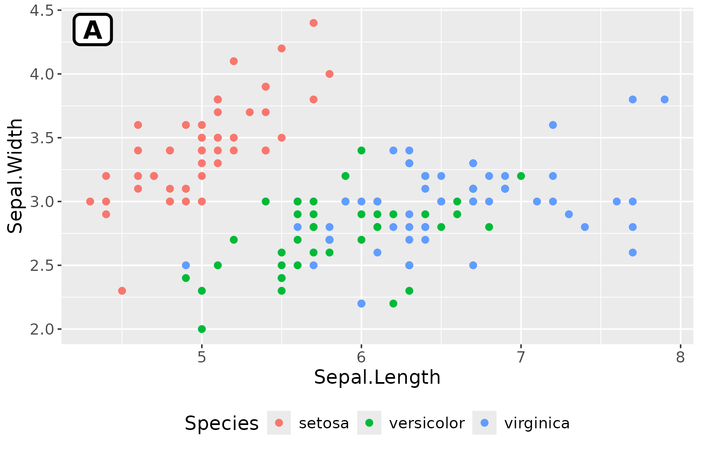
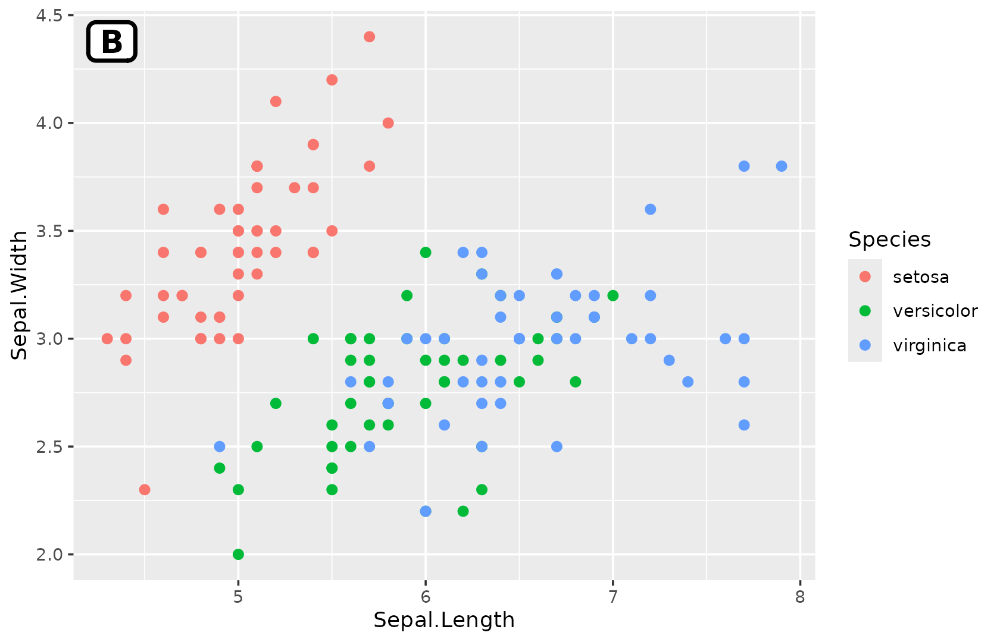
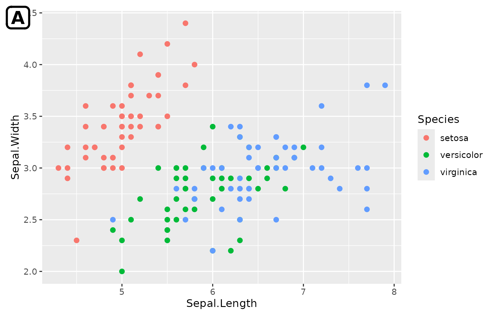
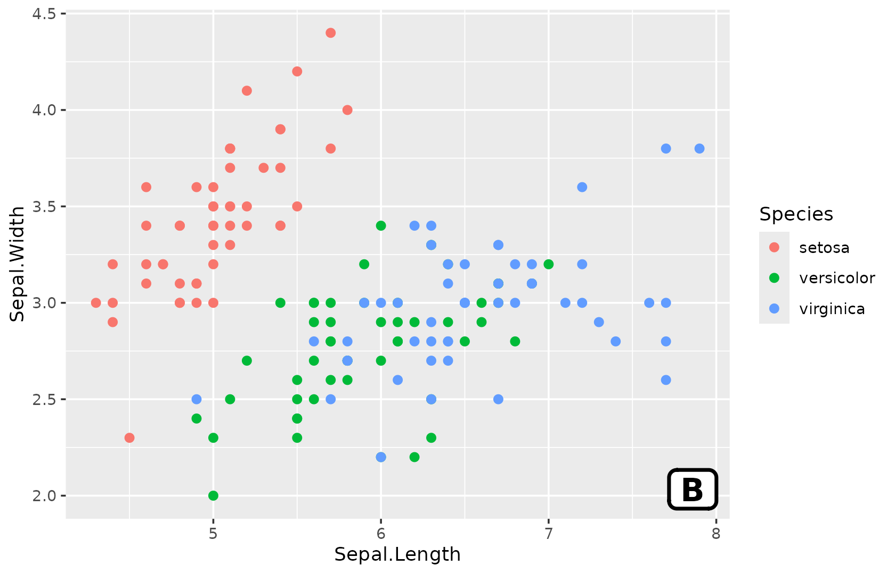
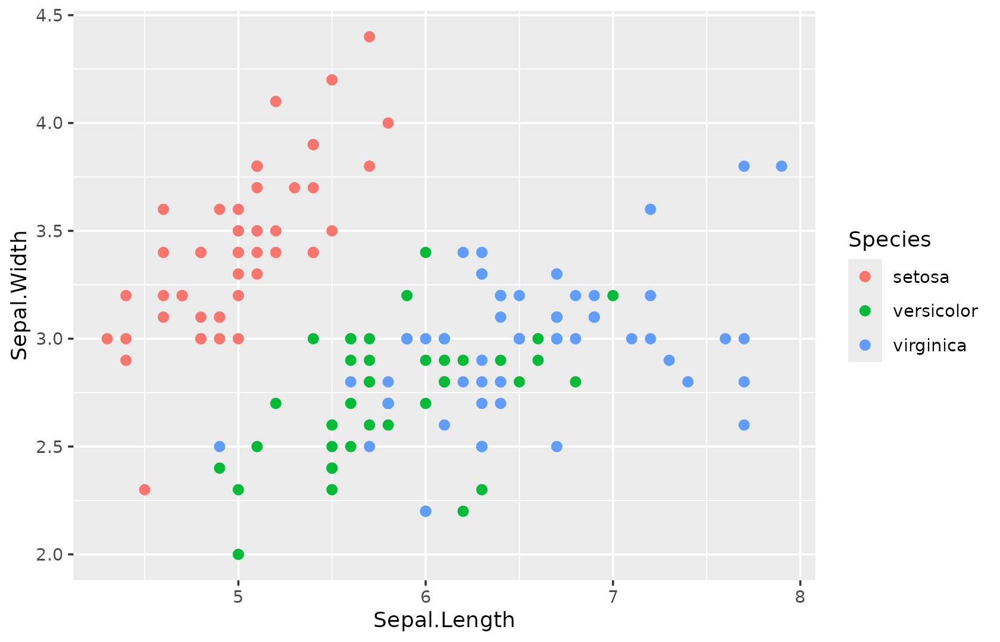
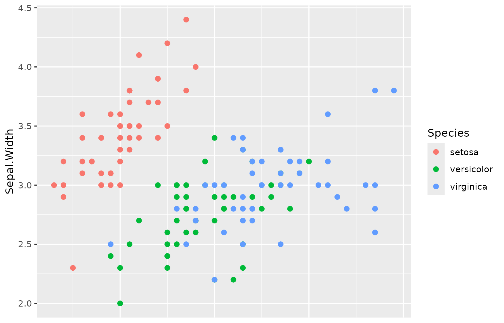
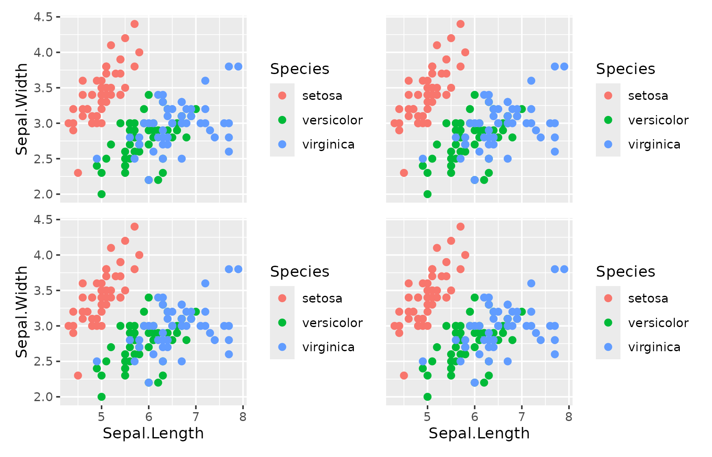
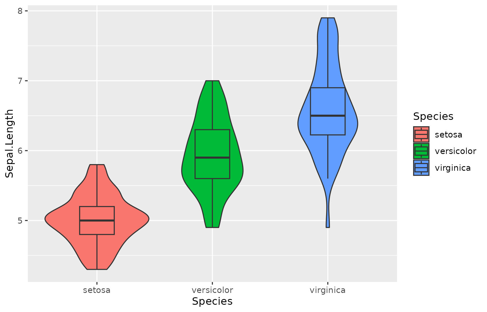
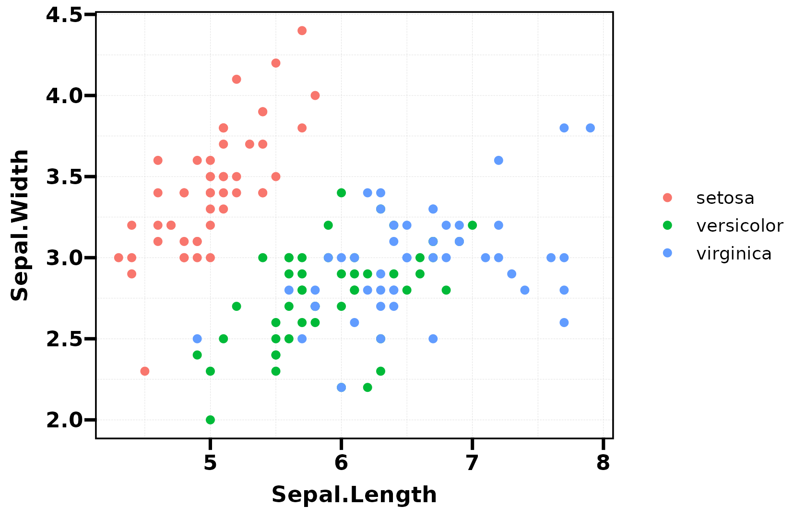
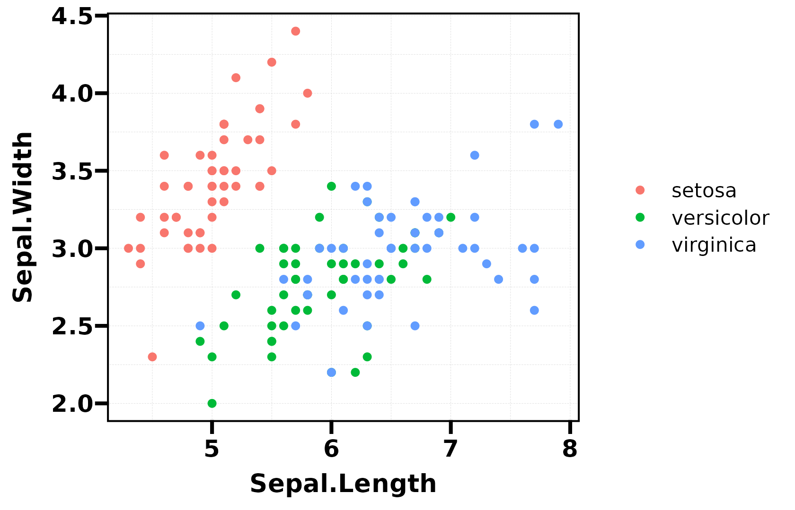

# ggplot2 Formatting: fmt\_\* and Themes

``` r

library(UtilsR)
library(ggplot2)
```

## Base Plot

All examples build on this base plot:

``` r

p <- ggplot(iris, aes(Sepal.Length, Sepal.Width, color = Species)) +
  geom_point(size = 2)
p
```


------------------------------------------------------------------------

## `fmt_plot()` — Master Chaining

Chain multiple formatting operations in one call:

``` r

p |> fmt_plot(
  fmt_legend_list = list(legend.position = "bottom"),
  fmt_tag_list = list(labels = "A")
) + theme(text = element_text(size = 14))
```



------------------------------------------------------------------------

## `fmt_tag()` — Panel Labels

``` r

p |> fmt_tag("A")
```


``` r

p |> fmt_tag("B", label_position = c(0.95, 0.95), size = 16)
```



Labels follow data plots through nested patchworks, skipping spacers,
guide areas and insets. Automatic labels continue after Z as AA, AB, and
so on. Calling
[`fmt_tag()`](https://hui950319.github.io/UtilsR/reference/fmt_tag.md)
again replaces its earlier tags while keeping user annotations. Inside a
faceted plot the same label appears in each facet; an outside tag
appears once for the whole plot. Inside-only styling such as `fill` and
`alpha` is passed to
[`ggpp::geom_label_npc()`](https://docs.r4photobiology.info/ggpp/reference/geom_text_npc.html)
through `...`.

``` r

outside <- fmt_tag(p, "A", label_position = "tl-out",
                   label.padding = grid::unit(0.3, "lines"))
outside
```



``` r

fmt_tag(outside, "B", label_position = "br")
```



------------------------------------------------------------------------

## `fmt_legend()` — Legend Formatting

``` r

p |> fmt_legend(position = "bottom", direction = "horizontal")
```


------------------------------------------------------------------------

## `fmt_ref()` — Reference Lines

``` r

p |> fmt_ref(xintercept = 5.8, yintercept = 3.0)
```



``` r

# Multiple lines with colours
p |> fmt_ref(xintercept = c(5, 6, 7), color = c("red", "blue", "green"))
```


------------------------------------------------------------------------

## `fmt_axis()` — Axis Control

``` r

# Hide x-axis (useful for multi-panel layouts)
p |> fmt_axis(x.axis = TRUE)
```



`FALSE` retains the current axes and does not restore elements hidden
earlier. For a single plot, `TRUE` hides its selected axis. In a
container, explicit indices count editable plots recursively, excluding
spacers, guide areas, insets and fixed wrapped graphics.

``` r

p_grid <- patchwork::wrap_plots(p, p, p, p, nrow = 2, byrow = FALSE)
fmt_axis(p_grid, plot_dims = c(2, 2))
```



`plot_dims` takes precedence over both manual selectors. Lists use the
supplied grid dimensions; patchworks follow their existing positions,
including empty cells, nesting and spanning design areas. This hides
decoration only: it does not make different scales identical. For flat
patchworks with matching axes,
`patchwork::plot_layout(axes = "collect", axis_titles = "collect")` is
also available. Format a ggplot before wrapping it with
[`wrap_elements()`](https://patchwork.data-imaginist.com/reference/wrap_elements.html).

------------------------------------------------------------------------

## `fmt_strip()` — Facet Strip Colours

``` r

p_facet <- ggplot(iris, aes(Sepal.Length, Sepal.Width)) +
  geom_point() +
  facet_wrap(~Species)

p_facet |> fmt_strip(label_fill = c("#E41A1C", "#377EB8", "#4DAF4A"))
```

------------------------------------------------------------------------

## `fmt_bg()` — Background Stripes

``` r

p |> fmt_bg(palette = "Paired", alpha = 0.1)
```

------------------------------------------------------------------------

## `fmt_scale()` — Axis Scales

``` r

p |> fmt_scale(scale_x_list = list(limits = c(4, 8)),
               scale_y_list = list(limits = c(2, 4.5)))
```

------------------------------------------------------------------------

## `fmt_boxplot()` — Overlay Boxplot

``` r

p_violin <- ggplot(iris, aes(Species, Sepal.Length, fill = Species)) +
  geom_violin()
p_violin |> fmt_boxplot()
```



------------------------------------------------------------------------

## Themes

### `theme_my()` — Clean General Purpose

``` r

p + theme_my()
```



### `theme_my()` with custom base size

``` r

p + theme_my(base_size = 16)
```



------------------------------------------------------------------------

## `flatten_patchwork()` — Flatten Nested Patchwork

``` r

library(patchwork)
nested <- (p1 | p2) / (p3 | p4)
flat <- flatten_patchwork(nested)
```

Recursively flattens nested patchwork objects into a single-level list.
